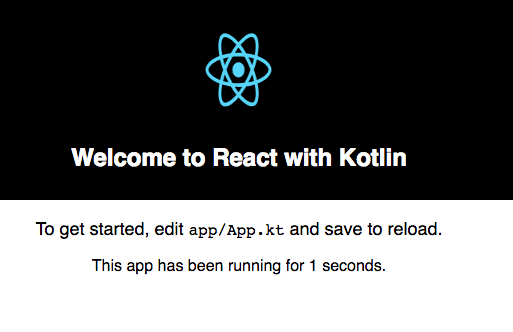

Kotlin React Demo
=================

Kotlin官方提供了一个工具叫[Create React Kotlin App](https://github.com/JetBrains/create-react-kotlin-app)，这个项目的基本骨架就是用它创建的。
但是我倾向于使用gradle，可以提供更多的控制，所以创建了`build.gradle`文件，并且依照要求进行了配置。

项目中使用的库来源于<https://github.com/JetBrains/kotlin-wrappers>

运行：

```
npm install
npm start
```

它会在浏览器中打开相应的地址。在本地修改了kotlin文件，会自动生效，感觉很不错。



更多详情参看：<./README_ori.md>